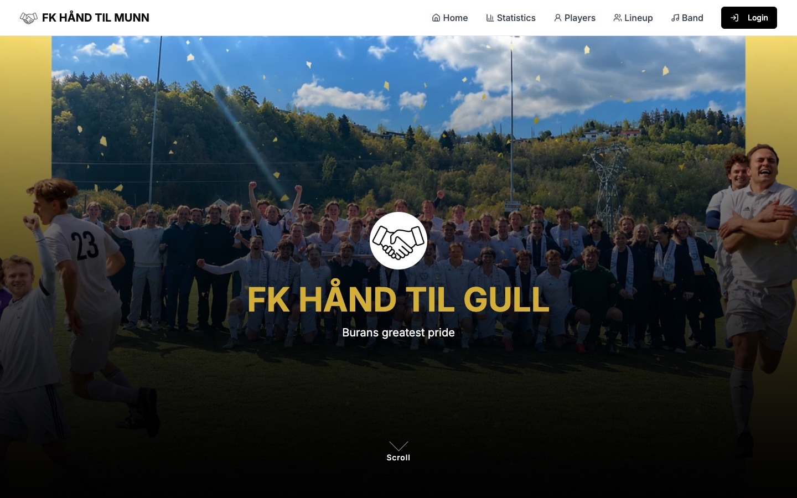
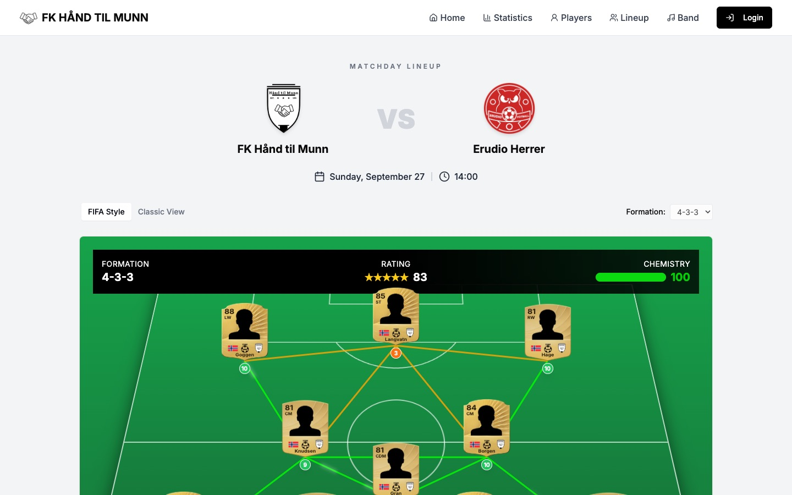
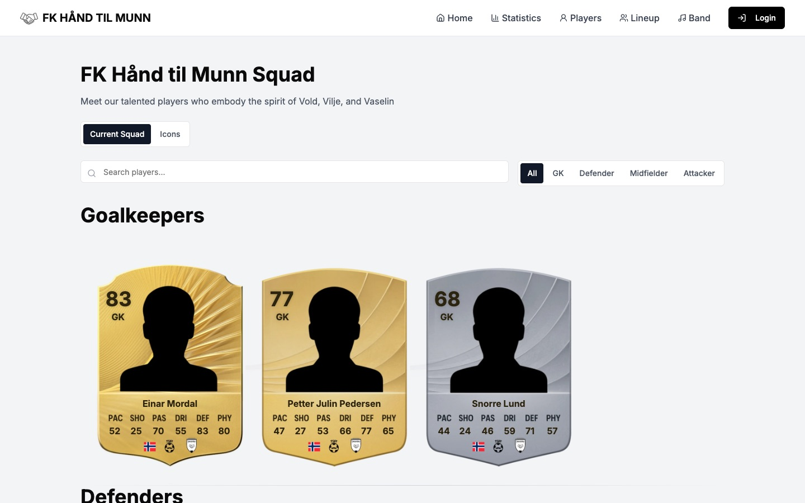
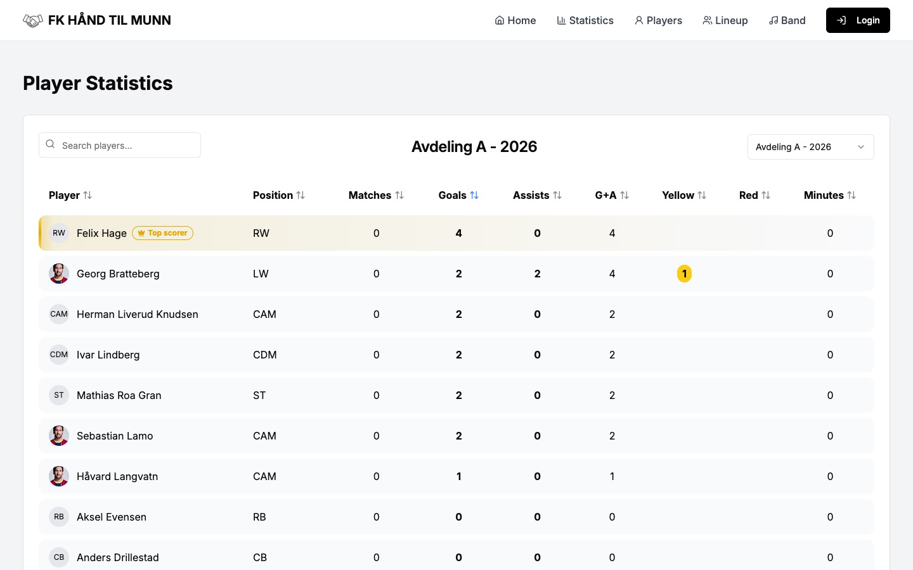
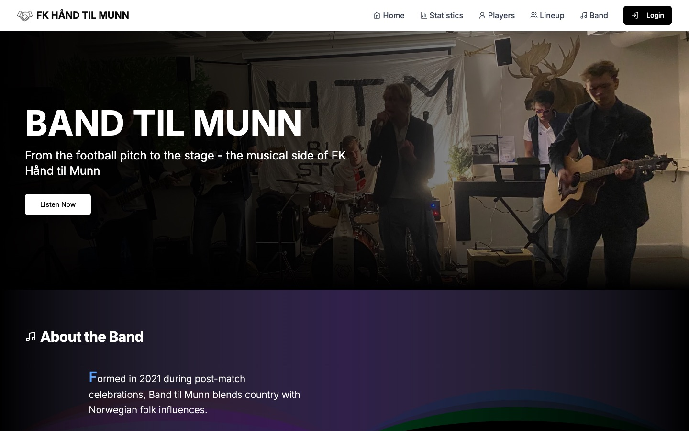

# FK Hånd til Munn

The website for FK Hånd til Munn, a Norwegian amateur football club, and for Band til Munn, the club's own band.

**Live:** [fkhandtilmunn.com](https://fkhandtilmunn.com)



| Matchday lineup | Squad |
|---|---|
|  |  |
| **Player statistics** | **Band til Munn** |
|  |  |

## Features

**For fans**
- **Squad** – every player as a FIFA-style card, with the card tier (bronze, silver, gold) based on their rating
- **Lineup** – the next match's starting eleven on a pitch, with formation, substitutes and position chemistry
- **League tables and results** – standings, fixtures and results for every league and season the club has played
- **Statistics** – top scorers, assists, cards, clean sheets and minutes played per league
- **News** – match reports and club news with images
- **Band page** – members, upcoming shows and a booking form that emails the band

**For the admin**
- A password-protected dashboard for managing players, matches, results, lineups, statistics and news
- A rich text editor for news articles, with image upload
- A lineup builder with a live preview of how it will look on the site

## Tech stack

| | |
|---|---|
| Framework | [Next.js 14](https://nextjs.org) (App Router), React, TypeScript |
| Styling | Tailwind CSS, [shadcn/ui](https://ui.shadcn.com) / Radix UI |
| Database and storage | [Supabase](https://supabase.com) (Postgres + Storage) |
| Auth | Signed JWT sessions in httpOnly cookies ([jose](https://github.com/panva/jose)) |
| Email | [Resend](https://resend.com) |
| Editor | [Tiptap](https://tiptap.dev) |
| Validation | [Zod](https://zod.dev) |
| Hosting | [Vercel](https://vercel.com) |

## Security

The code is public, so the site is built not to rely on it being secret:

- **The browser never talks to the database.** All reads and writes go through server code using Supabase's service-role key. Row Level Security is on for every table with no policies, and the public `anon` role has no rights at all ([`supabase/enable-rls.sql`](supabase/enable-rls.sql)).
- **Admin access is checked on the server.** [`middleware.ts`](middleware.ts) requires a valid admin session for every `/admin` page and every API route that changes data. Server actions check it again themselves, since middleware doesn't cover them.
- **Sessions** are HS256-signed JWTs in httpOnly, `SameSite=Lax` cookies that expire 30 minutes after login.
- **Login** compares credentials in constant time and locks an IP out after 5 failed attempts in 10 minutes.
- **The booking form**, the only public form that writes data, is validated with Zod, has a honeypot field against bots and HTML-escapes user text before it goes into the email.
- **Secrets** live only in environment variables (`.env.local` locally, Vercel in production) and have never been committed.

## Running it locally

You need Node.js 18+ and a Supabase project.

```bash
npm install
cp .env.example .env.local   # then fill in the values
npm run dev
```

Open [http://localhost:3000](http://localhost:3000). The admin dashboard is at `/login`.

To lock down a new Supabase project the same way as production, run [`supabase/enable-rls.sql`](supabase/enable-rls.sql) in the Supabase SQL editor.

## Project structure

```
app/          Pages (App Router) and API routes under app/api
actions/      Server actions for reading data
components/   UI components; components/ui holds the shadcn/ui primitives
lib/          Auth, Supabase client and shared helpers
utils/        Football logic: formations, chemistry, card tiers, stats
supabase/     SQL for the database security setup
types/        Generated Supabase types
public/       Images, logos and card templates
```

## Deployment

`main` deploys to production on Vercel. Every other branch gets its own preview deployment.
